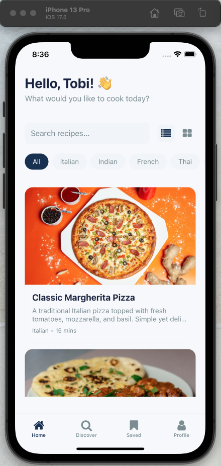

# Recipe Book

~ Vibe Coding ~ 

Motivation: to store my personal recipes and share with friends/family

## Get started

1. Install dependencies

   ```bash
   npm install
   ```

2. Start the app

   ```bash
   npx expo start --clear
   ```

In the output, you'll find options to open the app in a

- [development build](https://docs.expo.dev/develop/development-builds/introduction/)
- [Android emulator](https://docs.expo.dev/workflow/android-studio-emulator/)
- [iOS simulator](https://docs.expo.dev/workflow/ios-simulator/)
- [Expo Go](https://expo.dev/go), a limited sandbox for trying out app development with Expo



---

TODO
- authentication 
- state management 
- database -> users, recipes, saved recipes, images
- API -> CRUD 
